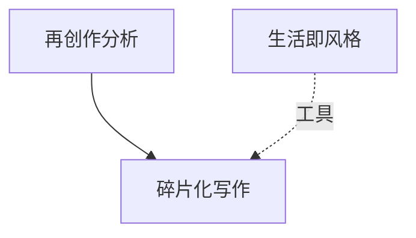

# INDEX — 《然而很美》cangjie 蒸馏包

> 5 个原子 skills · 候选池22条（补齐轮3→5） · 引文3/3通过
> 注：音乐文学散文，方法论密度低于理论著作，3个为合理产出

| skill | 一句话 | 触发核心 |
|-------|--------|---------|
| [standards-reinvention-analysis](standards-reinvention-analysis/SKILL.md) | 标准曲再创作的对话性分析 | 「这个翻唱怎么样」 |
| [fragmentary-portrait-writing](fragmentary-portrait-writing/SKILL.md) | 碎片化人物写作三步法 | 「人物特稿怎么写」 |
| [jazz-life-music-unity](jazz-life-music-unity/SKILL.md) | 生活即风格的双向印证阅读 | 「悲剧艺术家更动人吗」 |
| [second-person-seance](second-person-seance/SKILL.md) | 招魂式第二人称悼亡写作 | 「怎么写悼念文章」 |
| [character-grounded-fiction](character-grounded-fiction/SKILL.md) | 性格依据虚构的边界技法 | 「历史小说能这样编吗」 |

