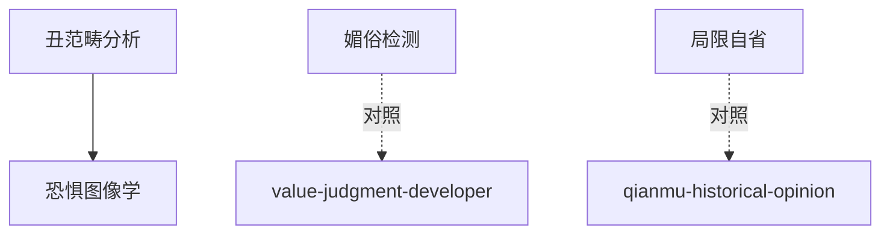

# INDEX — 《丑的历史》cangjie 蒸馏包

> 5 个原子 skills · 候选池20条（补齐轮4→5） · 引文5/5通过

| skill | 一句话 | 触发核心 |
|-------|--------|---------|
| [ugliness-category-analysis](ugliness-category-analysis/SKILL.md) | 丑的三层区分：东西/表现/观念史 | 「为什么人爱看恐怖片」 |
| [fear-iconography-reader](fear-iconography-reader/SKILL.md) | 恐惧图像学三问 | 「僵尸形象为何每代不同」 |
| [kitsch-detector](kitsch-detector/SKILL.md) | 媚俗检测三问+趣味自检 | 「说不出哪里假」 |
| [aesthetic-limitation-awareness](aesthetic-limitation-awareness/SKILL.md) | 材料局限自省声明法 | 「世界史怎么写开头」 |

| [enemy-uglification-analysis](enemy-uglification-analysis/SKILL.md) | 敌人丑怪化的镜像武器结构 | 「这张宣传画哪里有问题」 |
