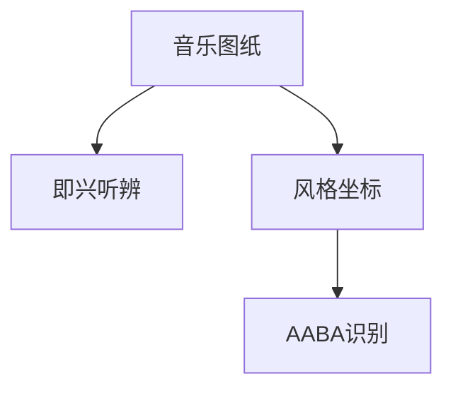

# INDEX — 《如何听爵士》cangjie 蒸馏包

> 4 个原子 skills · 候选池16条 · 引文全部通过

| skill | 一句话 | 触发核心 |
|-------|--------|---------|
| [jazz-chart-drawing](jazz-chart-drawing/SKILL.md) | 音乐图纸四步绘制 | 「爵士听起来好乱」 |
| [style-coordinate-locator](style-coordinate-locator/SKILL.md) | 风格谱系坐标三问 | 「这首属于什么爵士」 |
| [improv-structure-listening](improv-structure-listening/SKILL.md) | 即兴非随意听辨 | 「即兴是随便弹吗」 |
| [aaba-form-recognition](aaba-form-recognition/SKILL.md) | AABA曲式四步识别 | 「bridge是什么」 |

