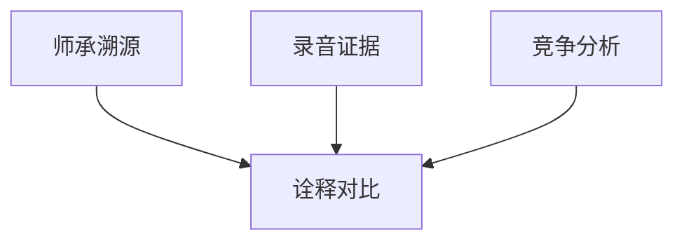

# INDEX — 《不朽的演奏家》cangjie 蒸馏包

> 4 个原子 skills · 候选池18条 · 引文4/4通过

| skill | 一句话 | 触发核心 |
|-------|--------|---------|
| [performer-lineage-tracing](performer-lineage-tracing/SKILL.md) | 师承链+学派定位+偏离清单 | 「他的风格跟谁学的」 |
| [interpretation-comparison](interpretation-comparison/SKILL.md) | 诠释对比：问作品观不排名次 | 「两个版本差在哪」 |
| [recording-as-evidence](recording-as-evidence/SKILL.md) | 断言-定位-复听三件套 | 「你说的问题在哪」 |
| [competition-in-performance](competition-in-performance/SKILL.md) | 竞争信号与文本仲裁时刻 | 「重奏里谁压住谁」 |

