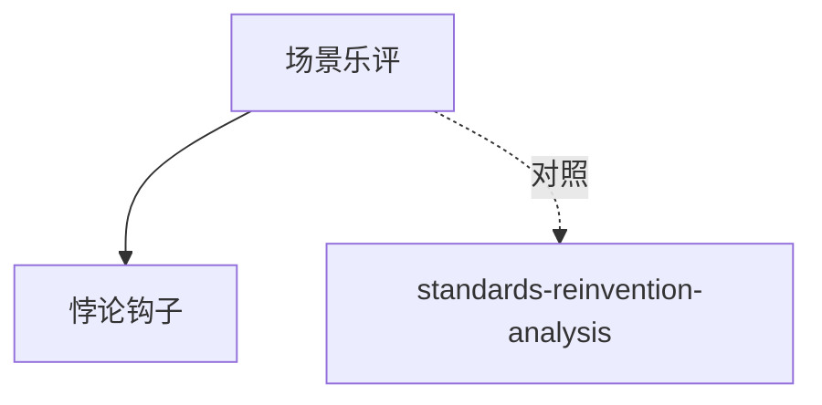

# INDEX — 《爵士群像》cangjie 蒸馏包

> 2 个原子 skills · 候选池16条 · 引文4/4通过
> 注：32KB音乐随笔集，2 skills为合理产出

| skill | 一句话 | 触发核心 |
|-------|--------|---------|
| [scene-based-music-review](scene-based-music-review/SKILL.md) | 场景嵌入式乐评三件套 | 「这张专辑怎么安利」 |
| [paradox-portrait-hook](paradox-portrait-hook/SKILL.md) | 悖论速写钩子句 | 「一句话概括这个人」 |

