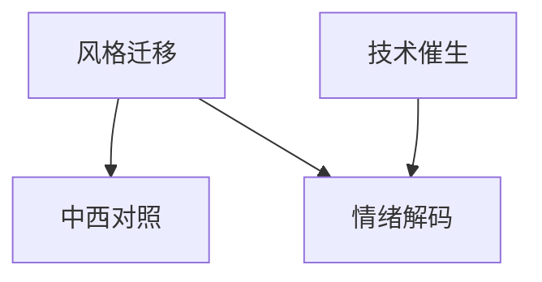

# INDEX — 《流行音乐史》（西方卷+中国卷）cangjie 蒸馏包

> 4 个原子 skills · 候选池18条 · 引文4/4通过

| skill | 一句话 | 触发核心 |
|-------|--------|---------|
| [style-migration-analyzer](style-migration-analyzer/SKILL.md) | 输入-本土化-反哺三段分析 | 「这种音乐怎么传开的」 |
| [tech-born-style-analysis](tech-born-style-analysis/SKILL.md) | 技术催生风格的反事实检验 | 「AI音乐算新风格吗」 |
| [social-mood-decoder](social-mood-decoder/SKILL.md) | 社会情绪三步解码 | 「这歌为什么突然火了」 |
| [china-west-pop-comparison](china-west-pop-comparison/SKILL.md) | 中西双卷平行对照 | 「华语乐坛在抄欧美吗」 |

