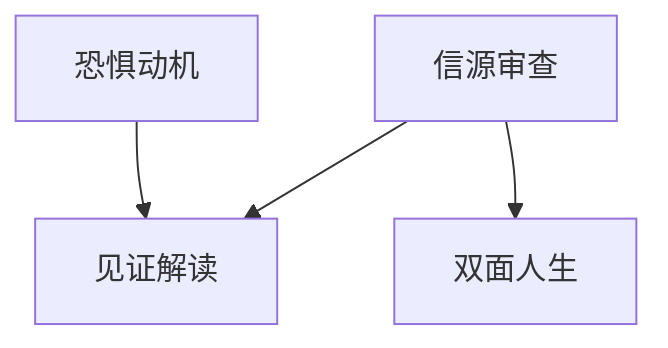

# INDEX — 《见证》cangjie 蒸馏包

> 4 个原子 skills · 候选池18条 · 引文3/3通过（OCR乱码以校勘注记处理）

| skill | 一句话 | 触发核心 |
|-------|--------|---------|
| [testimony-art-reading](testimony-art-reading/SKILL.md) | 艺术见证三问解码 | 「这首曲子到底在说什么」 |
| [double-life-analysis](double-life-analysis/SKILL.md) | 双面人生双清单分析 | 「他到底是屈服还是抗争」 |
| [source-authenticity-screen](source-authenticity-screen/SKILL.md) | 口述信源四项审查 | 「这本回忆录是真的吗」 |
| [fear-as-motive-reader](fear-as-motive-reader/SKILL.md) | 恐惧动机三步追踪 | 「为什么突然写这么阴暗」 |

⚠️ 使用前提：本书为伏尔科夫争议信源，引用须随注。
