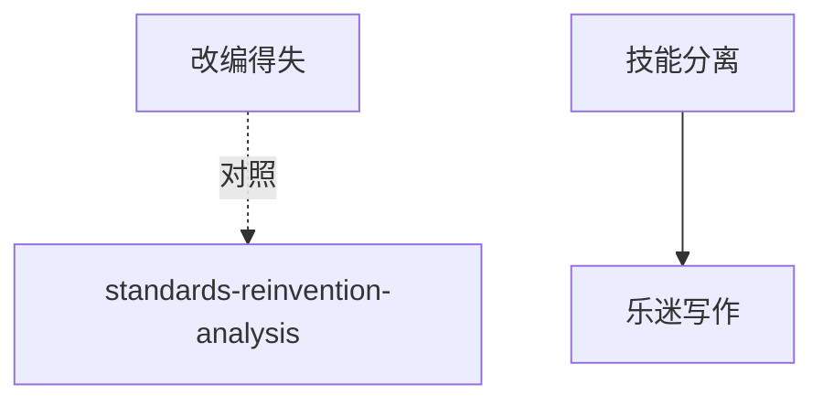

# INDEX — 《新丰年》cangjie 蒸馏包

> 3 个原子 skills · 候选池16条 · 引文全部通过
> 注：104KB随笔集，3 skills为合理产出

| skill | 一句话 | 触发核心 |
|-------|--------|---------|
| [adaptation-value-assessment](adaptation-value-assessment/SKILL.md) | 改编得失双向评估 | 「这个改编毁原著了」 |
| [creator-performer-separation](creator-performer-separation/SKILL.md) | 创作与演绎的技能分离 | 「作者亲自演更好吗」 |
| [amateur-music-writing](amateur-music-writing/SKILL.md) | 乐迷写作正当路径 | 「非专业能写乐评吗」 |

