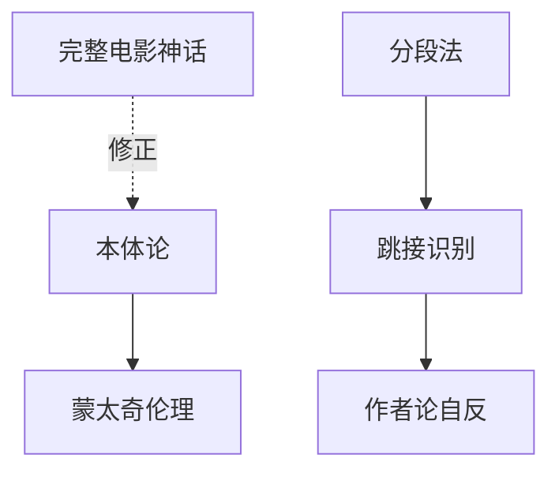

# INDEX — 《电影双书合蒸》cangjie 蒸馏包

> 6 个原子 skills · 候选池26条 · 引文6/6通过

| skill | 一句话 | 触发核心 |
|-------|--------|---------|
| [bazin-ontology-analysis](bazin-ontology-analysis/SKILL.md) | 木乃伊情结与物理成因链 | 「CGI和实拍的区别」 |
| [total-cinema-myth](total-cinema-myth/SKILL.md) | 完整电影神话：观念先行技术跟进 | 「为什么VR是终极媒介」 |
| [montage-ethics-review](montage-ethics-review/SKILL.md) | 蒙太奇越界三问审查 | 「剪辑在带节奏吗」 |
| [jump-cut-grammar-reader](jump-cut-grammar-reader/SKILL.md) | 跳接三步识别 | 「突然跳了一下是故意的吗」 |
| [segmentation-method](segmentation-method/SKILL.md) | 拉片分段表四步操作 | 「拉片作业怎么做」 |
| [auteur-self-reflexivity](auteur-self-reflexivity/SKILL.md) | 自反性三问 | 「元电影是什么类型」 |

