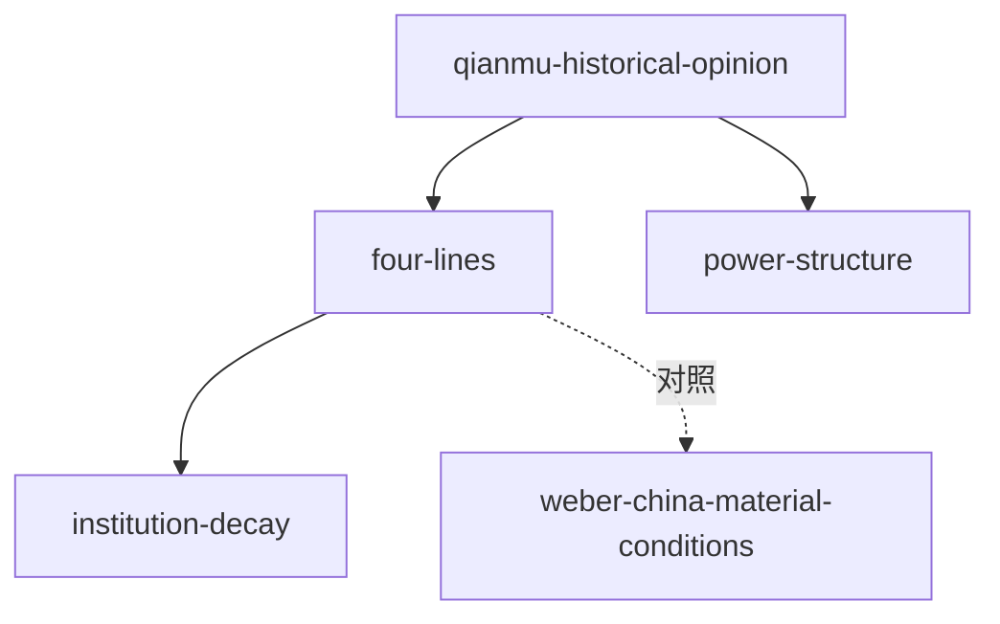

# INDEX — 《中国历代政治得失》cangjie 蒸馏包

> 4 个原子 skills · 候选池28条（20单元+8术语）· 引文20/20通过

| skill | 一句话 | 触发核心 |
|-------|--------|---------|
| [qianmu-historical-opinion](qianmu-historical-opinion/SKILL.md) | 历史意见/时代意见区分四步法 | 「科举好不好」类评析 |
| [qianmu-four-lines](qianmu-four-lines/SKILL.md) | 组织/选举/赋税/兵制四线拆解 | 「某朝制度全景」 |
| [qianmu-institution-decay](qianmu-institution-decay/SKILL.md) | 制度僵化三步诊断 | 「XX制为什么崩了」 |
| [qianmu-power-structure](qianmu-power-structure/SKILL.md) | 皇权相权结构判读+制度/法术之辨 | 「皇帝能随心所欲吗」 |

