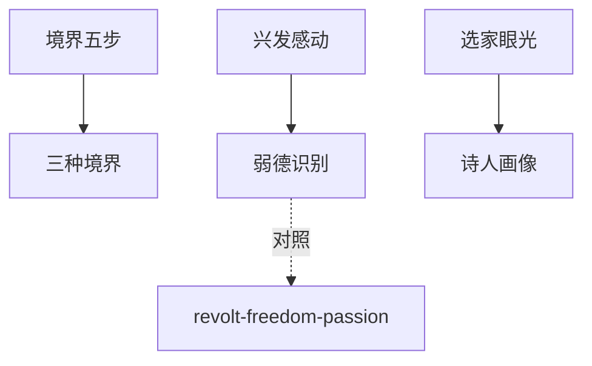

# INDEX — 《诗词鉴赏群书合蒸》cangjie 蒸馏包

> 6 个原子 skills · 候选池26条 · 引文7/7通过

| skill | 一句话 | 触发核心 |
|-------|--------|---------|
| [jingjie-five-step](jingjie-five-step/SKILL.md) | 境界五步鉴赏法 | 「这首诗好在哪」 |
| [three-realms-mapping](three-realms-mapping/SKILL.md) | 三种境界的人生阶段映射 | 「坚持不下去了」 |
| [xingfa-motion-analysis](xingfa-motion-analysis/SKILL.md) | 兴发感动三问分析 | 「这诗为什么动人」 |
| [weak-virtue-recognizer](weak-virtue-recognizer/SKILL.md) | 弱德之美三要素识别 | 「忍辱负重算美德吗」 |
| [anthology-eye-training](anthology-eye-training/SKILL.md) | 选家眼光四步训练 | 「选本为何不选它」 |
| [tang-poet-portraits-cangjie](tang-poet-portraits-cangjie/SKILL.md) | 诗人画像六格法 | 「李白杜甫的区别」 |

