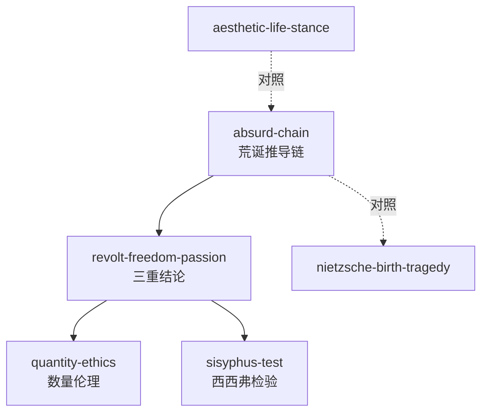

# GLOSSARY — 共享术语词典（《西西弗神话》）

| 术语 | 加缪用法 | ≠ |
|------|---------|---|
| 荒诞 (l'absurde) | 人对其意义的呼唤与世界不合理沉默之间的对峙——是关系不是属性 | ≠「荒谬/不合逻辑」——不涉及理智错误，涉及存在结构 |
| 反抗 (la révolte) | 对荒诞的不间断对峙：「我反抗，故我存在」 | ≠革命暴力——《反抗者》区分形而上反抗与历史造反 |
| 清醒 (la lucidité) | 直面无意义而不自欺的思想姿态；一切的前提 | ≠悲观主义——清醒者可同时是最有激情的生活者 |
| 跳 (le saut) | 从荒诞跃入信仰或体系以换取安宁＝哲学性的自杀 | ≠任何立场转变——只有动机是消除张力时才是跳 |
| 数量伦理 | 以经历的类型与数量对抗虚无；「与圣人追求质量相反」 | ≠享乐主义/消费主义——耗尽当下 vs 麻痹当下 |
| 荒诞人 | 保持清醒、不跳、以反抗/自由/激情生活的人 | ≠英雄——不需要非凡品质，只需要一致性 |

## 引用图

## 使用建议
- 入口：absurd-chain（先确认问题性质）
- 核心：revolt-freedom-passion（荒诞之后的三重生活策略）
- 展开：quantity-ethics（激情维度具体化）/ sisyphus-test（自洽性检验）
