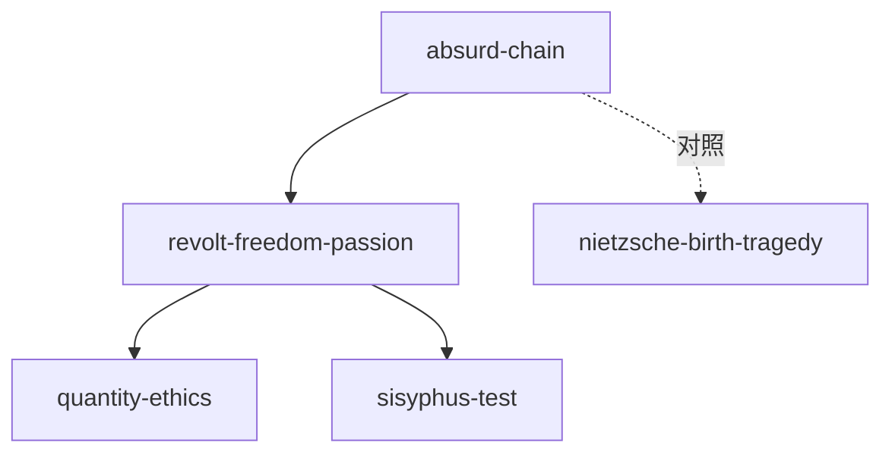

# INDEX — 《西西弗神话》cangjie 蒸馏包

> 4 个原子 skills + 共享词典 · cangjie-skill 流水线产出

| skill | 一句话 | 触发核心 |
|-------|--------|---------|
| [absurd-chain](absurd-chain/SKILL.md) | 荒诞=关系而非状态；两种取消方案皆无效 | 「活着到底有什么意义」 |
| [revolt-freedom-passion](revolt-freedom-passion/SKILL.md) | 三重结论：反抗/自由/激情的组合拳 | 「既然都会死那现在努力干嘛」 |
| [quantity-ethics](quantity-ethics/SKILL.md) | 唐璜式耗尽 vs 收藏式囤积 | 「深度和广度哪个重要」 |
| [sisyphus-test](sisyphus-test/SKILL.md) | 斗争本身足以充实人心吗 | 「这份工作看不到头」 |

术语见 [GLOSSARY.md](GLOSSARY.md)；精华长文见 [DIGEST.md](DIGEST.md)。
