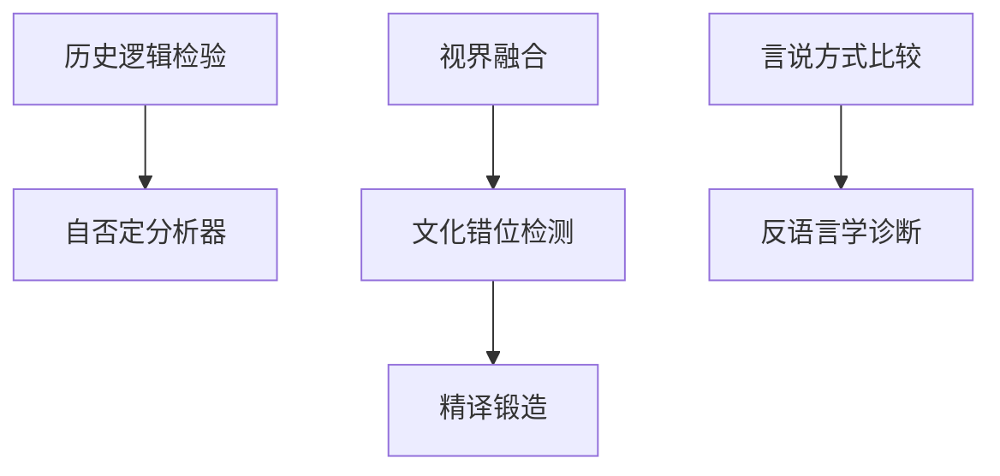

# INDEX — 《哲学史方法论十四讲》cangjie 蒸馏包

> 7 个原子 skills · 候选池23条（17单元+6术语）· 引文6/6通过

| skill | 一句话 | 触发核心 |
|-------|--------|---------|
| [history-logic-consistency-check](history-logic-consistency-check/SKILL.md) | 思想史研究的伪方法检验（换名字测试） | 「这篇论文方法论怎么样」 |
| [self-negation-analyzer](self-negation-analyzer/SKILL.md) | 自否定三步：初始形态→对立环节→转化 | 「这个概念怎么演变的」 |
| [cultural-dislocation-detector](cultural-dislocation-detector/SKILL.md) | 跨文化理解错位检测（问题意识对齐） | 「这个翻译对不对」 |
| [discourse-mode-comparison](discourse-mode-comparison/SKILL.md) | 言说方式即思维方式的外显 | 「论语和对话录的差异」 |
| [anti-linguistic-tendency-diagnosis](anti-linguistic-tendency-diagnosis/SKILL.md) | 语言自觉度诊断与后果链 | 「中文表达为什么模糊」 |
| [horizon-fusion-evaluator](horizon-fusion-evaluator/SKILL.md) | 视界融合+效果历史两问评估 | 「经典为什么常读常新」 |
| [sinicized-philosophy-review](sinicized-philosophy-review/SKILL.md) | 精译锻造四步定名法 | 「Dasein怎么翻译」 |

