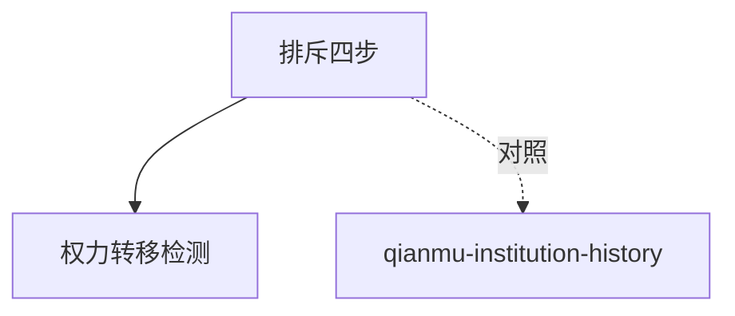

# INDEX — 《疯癫与文明》cangjie 蒸馏包

> 2 个原子 skills · cangjie-skill 流水线产出

| skill | 一句话 | 触发核心 |
|-------|--------|---------|
| [exclusion-mechanism-analysis](exclusion-mechanism-analysis/SKILL.md) | 排斥机制四步：断代→混杂名单→话语→权力面 | 「正常由谁定义」 |
| [humane-reform-power-shift](humane-reform-power-shift/SKILL.md) | 人道化改革=权力转移检测 | 「改革后是更自由还是更累」 |

