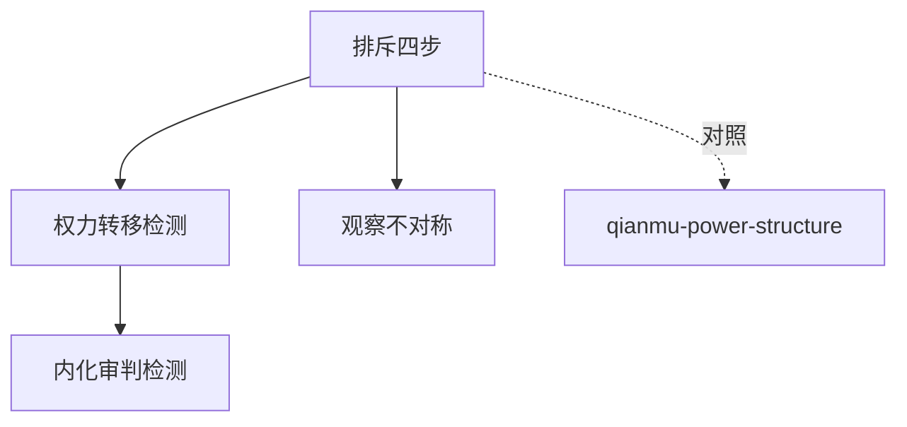

# INDEX — 《疯癫与文明》cangjie 蒸馏包

> 4 个原子 skills · 候选池27条（18单元+9术语）· 引文18/18通过

| skill | 一句话 | 触发核心 |
|-------|--------|---------|
| [exclusion-mechanism-analysis](exclusion-mechanism-analysis/SKILL.md) | 排斥机制四步分析 | 「正常由谁定义」 |
| [humane-reform-power-shift](humane-reform-power-shift/SKILL.md) | 人道化改革=权力转移检测 | 「改革后是更自由还是更累」 |
| [observation-asymmetry](observation-asymmetry/SKILL.md) | 观察权力不对称三问 | 「被盯着不舒服」 |
| [internalized-judgment-detector](internalized-judgment-detector/SKILL.md) | 内化审判检测三问 | 「自发地焦虑自责」 |

