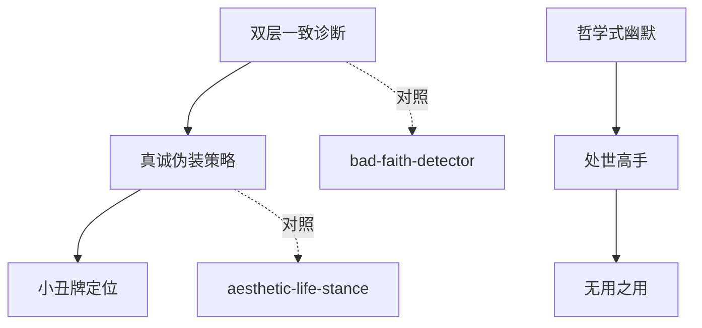

# INDEX — 《游心之路》cangjie 蒸馏包

> 6 个原子 skills · 候选池25条（19单元+6术语）· 引文10/10通过

| skill | 一句话 | 触发核心 |
|-------|--------|---------|
| [double-consistency-diagnostic](double-consistency-diagnostic/SKILL.md) | 单层合规vs双层要求的内耗诊断 | 「活得像在演戏」 |
| [genuine-pretending-strategy](genuine-pretending-strategy/SKILL.md) | 全情投入+随时出戏三步检验 | 「入戏太深出不来」 |
| [philosophical-humor-analysis](philosophical-humor-analysis/SKILL.md) | 幽默三功能分析 | 「这个笑话好深刻」 |
| [smooth-operator-recognition](smooth-operator-recognition/SKILL.md) | 处世高手三特征模式卡 | 「不按规则玩反而赢了」 |
| [joker-positioning](joker-positioning/SKILL.md) | 小丑牌定位三问 | 「我不想被归类」 |
| [useless-usefulness](useless-usefulness/SKILL.md) | 免于有用性收割的自由 | 「没用的事为什么要做」 |

