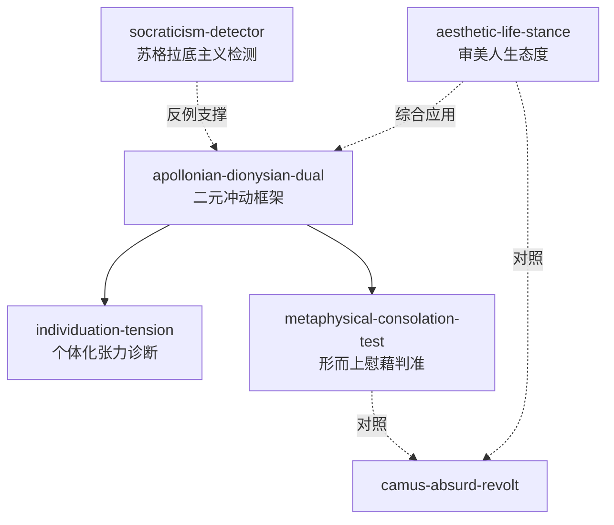

# GLOSSARY — 共享术语词典（《悲剧的诞生》）

| 术语 | 尼采用法 | ≠ |
|------|---------|---|
| 日神（阿波罗） | 美的外观之神；梦境造型冲动；个体化原理的神圣形象 | ≠理性/秩序的日常义——是幻象与造型冲动 |
| 酒神（狄奥尼索斯） | 「情绪的总激发和总释放」；醉境；个体界限崩溃、与太一融合的音乐性冲动 | ≠放纵享乐——痛苦与欢欣交织的原始统一体验 |
| 个体化原理 (principium individuationis) | 人与世界彼此划界的秩序原则；如舟子信赖扁舟置身苦海 | ≠个人主义——认识论/形而上界限而非社会主张 |
| 太一 (das Ur-Eine) | 个体消融所回归的原始统一体；摩耶面纱撕裂后的存在根基 | ≠上帝/人格神——非人格的生命本体 |
| 形而上的慰藉 | 悲剧快感之源：现象变而生命本体坚不可摧且充满欢乐 | ≠宗教安慰——无需来世或神，只需对生命本体的审美确信 |
| 审美苏格拉底主义 | 「理解然后美」——以可理解性为最高审美标准 | ≠理性本身——反对的是理性僭越为唯一裁判 |
| 音乐精神 | 意志的直接摹本，不依赖形象概念；悲剧由之生、随其亡 | ≠字面音乐作品——一切艺术中不可言说的直接性内核 |
| 萨提儿歌队 | 悲剧原初现象与形而上慰藉的体现者 | ≠合唱伴奏——酒神希腊人的自我镜像、悲剧母体 |

## 引用图

## 使用建议
- 入口：apollonian-dionysian-dual（先给作品/现象定位）
- 深入：individuation-tension（文化与心理诊断）
- 检验：metaphysical-consolation-test（直面苦难的作品是否成立）
- 批判：socraticism-detector（理性化过度检测）
- 综合：aesthetic-life-stance（个人生存姿态）
