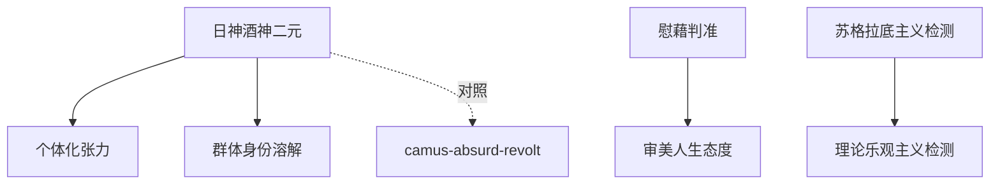

# INDEX — 《悲剧的诞生》cangjie 蒸馏包

> 7 个原子 skills · 候选池38条（26+12补充）· 引文全部通过

| skill | 一句话 | 触发核心 |
|-------|--------|---------|
| [apollonian-dionysian-dual](apollonian-dionysian-dual/SKILL.md) | 日神/酒神二元冲动定位框架 | 「这部作品的气质」 |
| [individuation-tension](individuation-tension/SKILL.md) | 个体化原理与太一的张力诊断 | 「自我与世界的关系」 |
| [metaphysical-consolation-test](metaphysical-consolation-test/SKILL.md) | 形而上慰藉判准 | 「苦难叙事是否成立」 |
| [socraticism-detector](socraticism-detector/SKILL.md) | 苏格拉底主义（理性化过度）检测 | 「理性化是否过度了」 |
| [aesthetic-life-stance](aesthetic-life-stance/SKILL.md) | 审美人生态度 | 「无意义时代怎么活」 |
| [theoretical-optimism-detector](theoretical-optimism-detector/SKILL.md) | 科学乐观主义三问检测 | 「科技能解决一切吗」 |
| [collective-identity-dissolution](collective-identity-dissolution/SKILL.md) | 群体身份溶解三要素 | 「现场融化/散场空虚」 |

