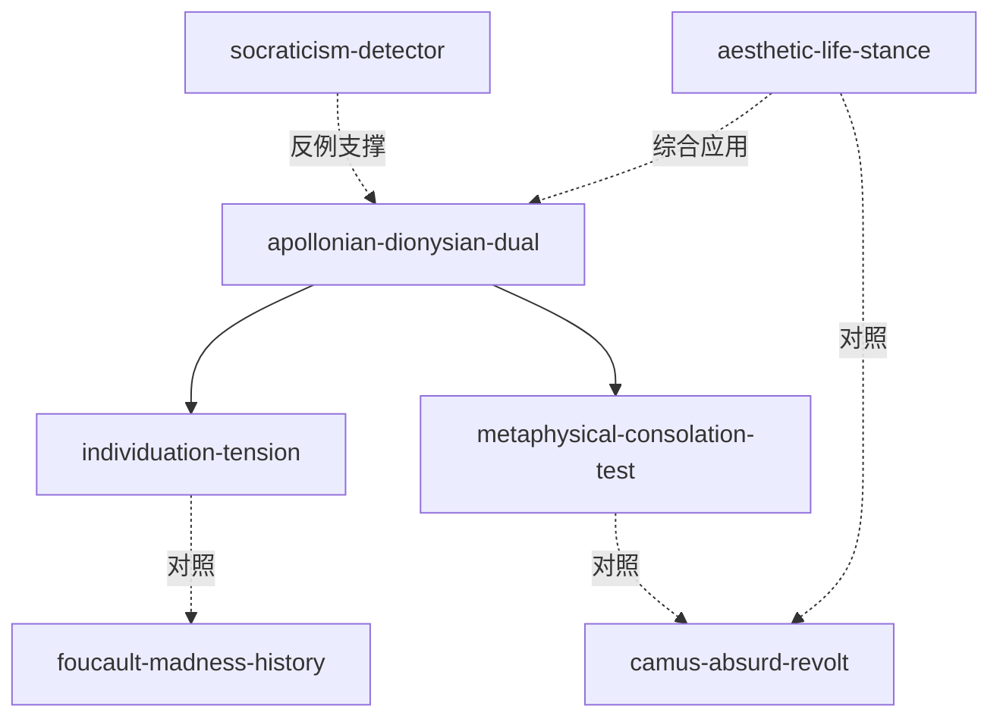

# INDEX — 《悲剧的诞生》cangjie 蒸馏包

> 5 个原子 skills + 共享词典 + 精华导读 · cangjie-skill 流水线产出（RIA-TV++）

## Skills 总览

| skill | 一句话 | 触发核心 |
|-------|--------|---------|
| [apollonian-dionysian-dual](apollonian-dionysian-dual/SKILL.md) | 日神/酒神两极给作品定气质 | 「这作品什么气质」「为什么狂欢让人快乐」 |
| [individuation-tension](individuation-tension/SKILL.md) | 个体化↔太一张力的文化心理诊断 | 「仪式/团队/节日的意义」 |
| [metaphysical-consolation-test](metaphysical-consolation-test/SKILL.md) | 直面苦难的艺术是否成立的判准 | 「这片子太丧了吧」「悲剧的意义」 |
| [socraticism-detector](socraticism-detector/SKILL.md) | 理性化过度的三症状检测 | 「什么都量化了」「没人聊感受了」 |
| [aesthetic-life-stance](aesthetic-life-stance/SKILL.md) | 审美人生态度：无意义的第三条路 | 「活着图什么」「不骗自己的活法」 |

## 引用图

## 术语
见 [GLOSSARY.md](GLOSSARY.md) — 8 个核心概念的「尼采用法 ≠ 日常用法」对照。

## 精华长文
见 [DIGEST.md](DIGEST.md) — 不读全书的快速通道。
