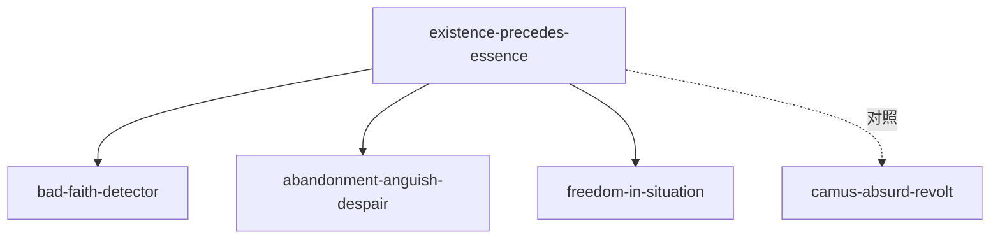

# INDEX — 《存在主义是一种人道主义》cangjie 蒸馏包

> 4 个原子 skills · 候选池23条（16单元+7术语）· 引文15/15通过

| skill | 一句话 | 触发核心 |
|-------|--------|---------|
| [existence-precedes-essence](existence-precedes-essence/SKILL.md) | 身不由己辩解四步检验 | 「我天生就是这样」 |
| [bad-faith-detector](bad-faith-detector/SKILL.md) | 自我欺骗三形态识别器 | 「没办法/不得不/大家都这样」 |
| [abandonment-anguish-despair](abandonment-anguish-despair/SKILL.md) | 听任·痛苦·绝望三联情感结构 | 「没有依靠了」 |
| [freedom-in-situation](freedom-in-situation/SKILL.md) | 处境中的自由第三立场 | 「环境这样我还能怎么办」 |

