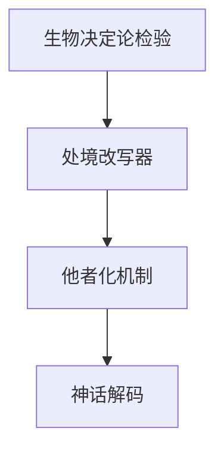

# INDEX — 《第二性》I cangjie 蒸馏包

> 4 个原子 skills · 候选池18条 · 引文4/4通过

| skill | 一句话 | 触发核心 |
|-------|--------|---------|
| [othering-mechanism-analysis](othering-mechanism-analysis/SKILL.md) | 他者化三问检测 | 「这群体为何被那样看待」 |
| [situation-vs-essence-rewriter](situation-vs-essence-rewriter/SKILL.md) | 「天生如此」→「处境如此」 | 「这是天生的吗」 |
| [biological-determinism-check](biological-determinism-check/SKILL.md) | 生物决定论四步检验 | 「科学不是说…」 |
| [myth-decoding-lens](myth-decoding-lens/SKILL.md) | 神话二分解码 | 「圣母荡妇从哪来的」 |

