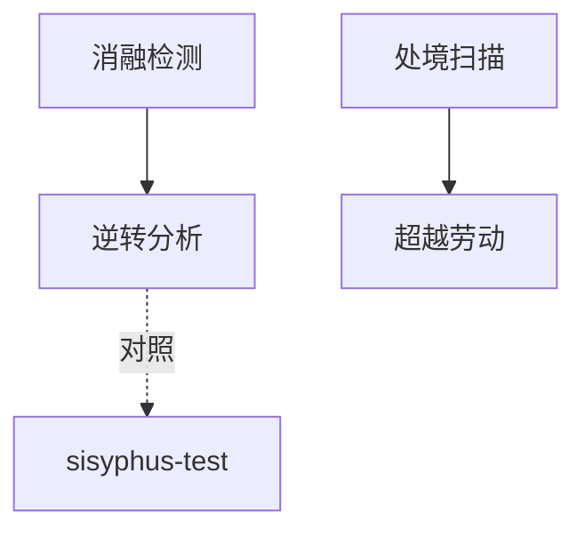

# INDEX — 《第二性》II cangjie 蒸馏包

> 4 个原子 skills · 候选池18条 · 引文4/4通过

| skill | 一句话 | 触发核心 |
|-------|--------|---------|
| [love-dissolution-detector](love-dissolution-detector/SKILL.md) | 恋爱消融三指标 | 「这是爱还是依赖」 |
| [object-subject-reversal](object-subject-reversal/SKILL.md) | 客体主体逆转的代价账 | 「她那样算自由吗」 |
| [life-stage-situation-scan](life-stage-situation-scan/SKILL.md) | 生命阶段处境五维扫描 | 「婚后像换了个人生」 |
| [transcendent-labor-check](transcendent-labor-check/SKILL.md) | 超越性劳动三问 | 「怎样才算独立」 |

