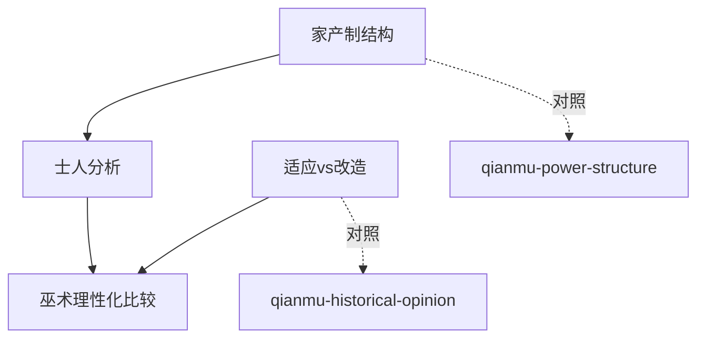

# INDEX — 《中国的宗教：儒教与道教》cangjie 蒸馏包

> 4 个原子 skills · 候选池22条（17单元+5术语）· 引文11/11通过

| skill | 一句话 | 触发核心 |
|-------|--------|---------|
| [adapt-vs-transform](adapt-vs-transform/SKILL.md) | 适应世界vs改造世界：组合体人格vs统一体 | 「为什么传统社会不鼓励变革」 |
| [patrimonial-structure-analysis](patrimonial-structure-analysis/SKILL.md) | 家产制三件套：俸禄国家×氏族自治×恶灵阻力 | 「皇权不下县」 |
| [literati-class-analysis](literati-class-analysis/SKILL.md) | 士人三重性格与「活书库」知识形态 | 「为何没有职业科学家」 |
| [magic-rationalization-comparison](magic-rationalization-comparison/SKILL.md) | 理性化方向比较（三重标注铁律） | 「李约瑟难题」 |

## ⚠️ 全包引用纪律
凡涉「中国为何无资本主义/科学」结论，必须三重标注：
韦伯原文 → 杨庆堃修正 → 余英时/彭慕兰反驳。单引韦伯=学术事故。
| [charisma-mismatch-analysis](charisma-mismatch-analysis/SKILL.md) | 制度功能vs民间赋义错位 | 「为什么迷信名校」 |
