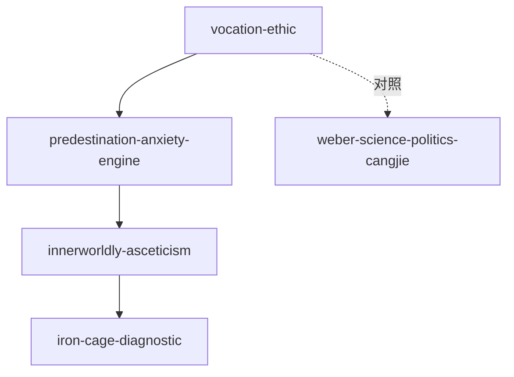

# INDEX — 《新教伦理与资本主义精神》cangjie 蒸馏包

> 4 个原子 skills · 候选池24条（19单元+5术语）· 引文7/7通过

| skill | 一句话 | 触发核心 |
|-------|--------|---------|
| [vocation-ethic-cangjie](vocation-ethic-cangjie/SKILL.md) | Beruf概念生成链：谋生/秩序/召唤三层 | 「把工作当修行」 |
| [predestination-anxiety-engine](predestination-anxiety-engine/SKILL.md) | 焦虑→义证→系统劳动的心理引擎 | 「停不下来」 |
| [innerworldly-asceticism](innerworldly-asceticism/SKILL.md) | 入世禁欲三要素与自律文化原型 | 「自律给我自由」 |
| [iron-cage-diagnostic](iron-cage-diagnostic/SKILL.md) | 价值动力枯竭的秩序惯性诊断 | 「为流程而流程」 |

## 引用纪律
引用韦伯必带限定语「选择性亲和」——单向因果「新教导致资本主义」是最常见误读（见 rejected/f04）。
| [wealth-reinvestment-divide](wealth-reinvestment-divide/SKILL.md) | 禁欲压制消费→财富再投资分流 | 「赚了钱为什么买地不扩产」 |
