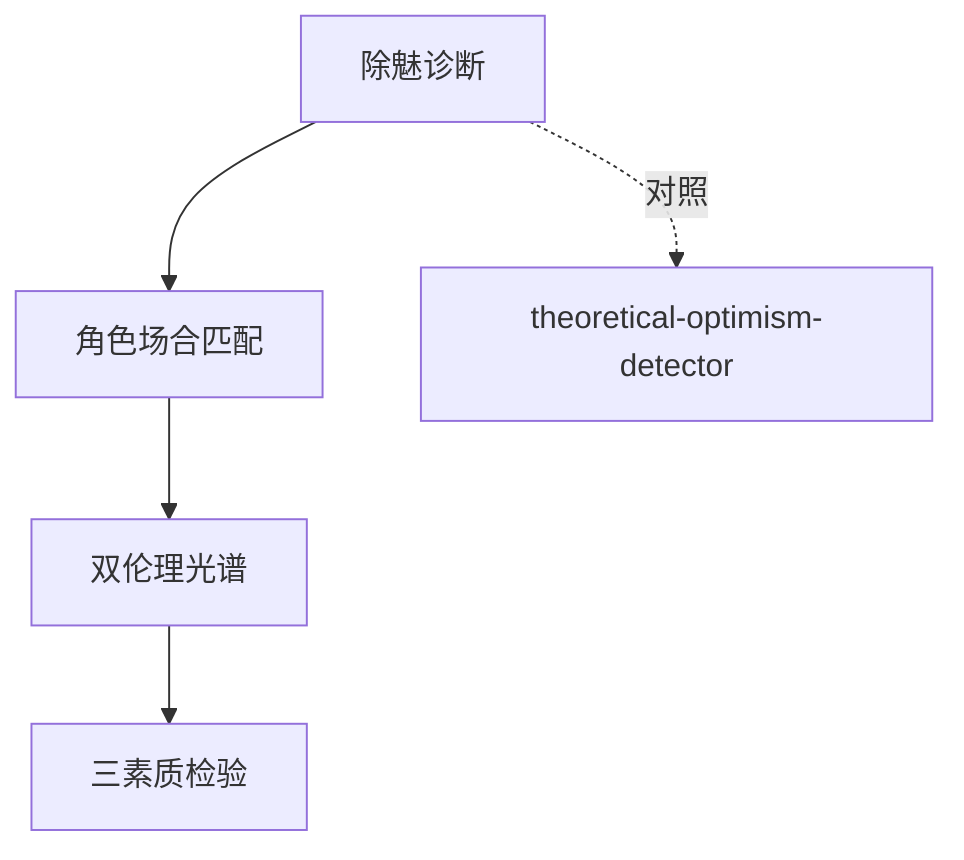

# GLOSSARY — 共享术语词典（《学术与政治》）

| 术语 | 韦伯用法 | ≠ |
|------|---------|---|
| 除魅 (Entzauberung) | 理知化进程——可计算性信念普及；再无神秘力量 | ≠进步叙事——除魅不增加意义 |
| 清明 (Klarheit) | 教师的道德成就：展示代价结构，抉择还给当事人 | ≠灌输价值观 |
| 心志伦理 (Gesinnungsethik) | 「行为正当，后果委诸上帝」 | ≠不负责任——不能简单化对立 |
| 责任伦理 (Verantwortungsethik) | 对可预见后果负责，不假定人性善 | ≠无原则功利主义 |
| 卡理斯玛 (Charisma) | 基于个人非凡性的支配类型 | ≠日常意义的魅力 |

## 引用图

## 译名纪律（钱永祥译本）
除魅（非「解除魔咒」）、心志伦理（非「信念伦理/意图伦理」）、清明、「我再无旁顾；这就是我的立场」、「即使如此，没关系」（dennoch）。
