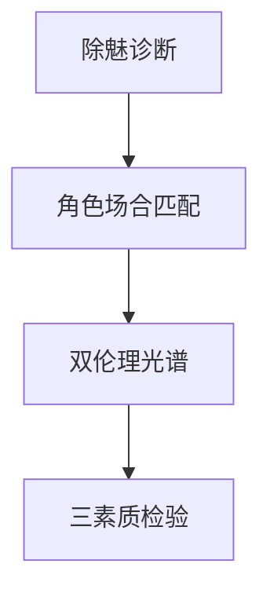

# INDEX — 《学术与政治》cangjie 蒸馏包

> 4 个原子 skills · 候选池27条（22单元+5术语）· 引文14/14通过
> ⚠️ 本包第一版为旧版格式贴牌假货，2026-08-25 彻底重做——以此为戒

| skill | 一句话 | 触发核心 |
|-------|--------|---------|
| [disenchantment-diagnosis](disenchantment-diagnosis/SKILL.md) | 除魅=计算力↑≠意义↑，两变量解耦 | 「科技发达为何还空虚」 |
| [role-occasion-matching](role-occasion-matching/SKILL.md) | 角色×场合两轴+大街测试+清明交付 | 「专家该不该谈立场」 |
| [ethic-spectrum-analyzer](ethic-spectrum-analyzer/SKILL.md) | 心志vs责任光谱定位（非善恶标签） | 「初心好就行吗」 |
| [statesman-quality-triad](statesman-quality-triad/SKILL.md) | 热情/责任/判断力三素质雷达 | 「有热情但不接地气」 |

术语见 GLOSSARY.md（含钱译本译名纪律）。
