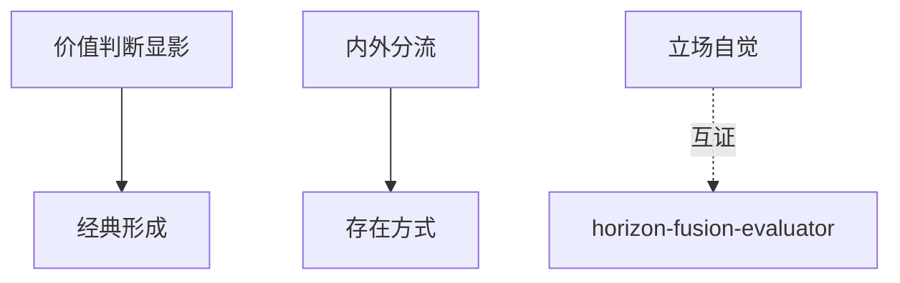

# INDEX — 《文学阅读透镜》cangjie 蒸馏包

> 5 个原子 skills · 候选池24条 · 引文7/7通过

| skill | 一句话 | 触发核心 |
|-------|--------|---------|
| [value-judgment-developer](value-judgment-developer/SKILL.md) | 判断结构三问显影 | 「这也能叫文学」 |
| [intrinsic-extrinsic-router](intrinsic-extrinsic-router/SKILL.md) | 内外研究分流器 | 「论文框架怎么搭」 |
| [work-mode-of-existence](work-mode-of-existence/SKILL.md) | 作品层面追问四层定位 | 「作品指什么」 |
| [reading-stance-awareness](reading-stance-awareness/SKILL.md) | 细读×语境×立场三源校验 | 「我只看文本本身」 |
| [canon-formation-analyzer](canon-formation-analyzer/SKILL.md) | 经典化路径时间线 | 「凭什么是经典」 |

