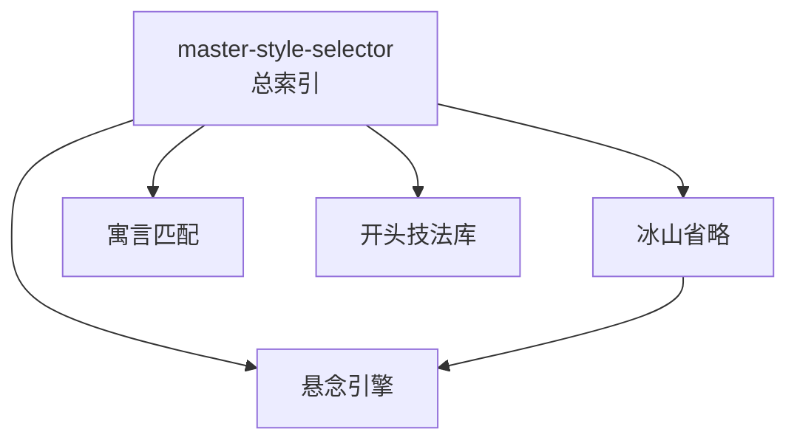

# INDEX — 《小说创作大师班》cangjie 蒸馏包

> 5 个原子 skills · 候选池15条（12单元+3术语）· 引文8/8通过

| skill | 一句话 | 触发核心 |
|-------|--------|---------|
| [iceberg-omission-method](iceberg-omission-method/SKILL.md) | 冰山省略两前提+复述测试 | 「什么都解释一遍」 |
| [suspense-engine-assembly](suspense-engine-assembly/SKILL.md) | 悬念三组件+兑现节律表 | 「中段没张力了」 |
| [allegory-structure-matching](allegory-structure-matching/SKILL.md) | 寓言结构适配性检验+封死解释口 | 「荒诞故事怎么写」 |
| [opening-technique-library](opening-technique-library/SKILL.md) | 开头四类技法+张力预演原则 | 「开头改二十遍」 |
| [master-style-selector](master-style-selector/SKILL.md) | 问题导向的大师方法索引 | 「对话生硬该学谁」 |

